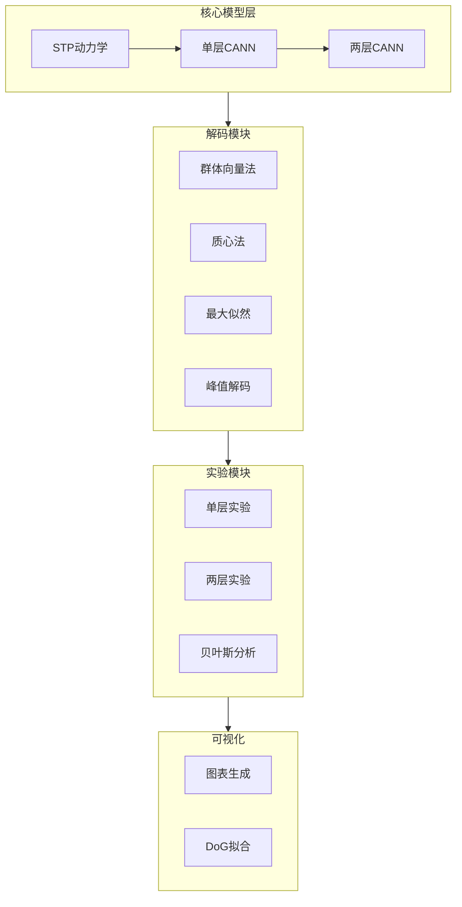

# Serial Dependence CANN 模型完整实现方案

## 项目架构



## 关键数学公式

### 1. CANN神经元动力学

$$\tau \frac{du(x,t)}{dt} = -u(x,t) + \rho \int dx' J(x,x') r(x',t) + I_{ext}(x,t)$$

发放率（除法归一化）：

$$r(x,t) = \frac{u(x,t)^2}{1 + k\rho \int u(x',t)^2 dx'}$$

连接权重（高斯核）：

$$J(x,x') = \frac{J_0}{\sqrt{2\pi}a} \exp\left(-\frac{(x-x')^2}{2a^2}\right)$$

### 2. STP动力学

$$\frac{dx}{dt} = \frac{1-x}{\tau_d} - u \cdot x \cdot r$$

$$\frac{du}{dt} = \frac{U-u}{\tau_f} + U(1-u)r$$

有效突触强度：$J_{eff} = J \cdot u \cdot x$

### 3. 两层网络连接

- 前馈连接（下层→上层）：$J_{ff}(x,x') = J_{ff,0} \exp(-|x-x'|^2/(2a_{ff}^2))$
- 反馈连接（上层→下层）：$J_{fb}(x,x') = J_{fb,0} \exp(-|x-x'|^2/(2a_{fb}^2))$

## 项目文件结构

```
CANN/
├── src/
│   ├── __init__.py
│   ├── models/
│   │   ├── __init__.py
│   │   ├── cann.py              # 单层CANN (约200行)
│   │   ├── two_layer_cann.py    # 两层CANN (约250行)
│   │   └── stp.py               # STP动力学 (约100行)
│   ├── decoding/
│   │   ├── __init__.py
│   │   └── decoders.py          # 4种解码方法 (约150行)
│   ├── experiments/
│   │   ├── __init__.py
│   │   ├── single_layer_exp.py  # Fig.2实验
│   │   ├── two_layer_exp.py     # Fig.3-4实验
│   │   └── bayesian_analysis.py # 贝叶斯分析
│   ├── analysis/
│   │   ├── __init__.py
│   │   └── dog_fitting.py       # DoG曲线拟合
│   └── visualization/
│       ├── __init__.py
│       └── plots.py             # 完整图表复现
├── configs/
│   └── params.py                # 参数配置
├── scripts/
│   ├── run_fig2.py              # 复现Fig.2
│   ├── run_fig3.py              # 复现Fig.3
│   ├── run_fig4.py              # 复现Fig.4
│   └── run_all.py               # 运行所有实验
├── results/                     # 输出目录
├── requirements.txt
└── README.md
```

## 核心参数（来自论文）

| 参数 | 符号 | 值 | 描述 |
|------|------|-----|------|
| 神经元数量 | N | 180 | 覆盖180°朝向空间 |
| 时间常数 | τ | 1 ms | 膜电位时间常数 |
| 连接强度 | J₀ | 0.5 | 递归连接强度 |
| 调谐宽度 | a | 30° | 高斯调谐宽度 |
| STD时间常数 | τ_d | 3 s | 下层STD主导 |
| STF时间常数 | τ_f | 5 s | 上层STF主导 |
| 基础释放概率 | U | 0.3 | STP基础参数 |
| 刺激强度 | A | 1.0 | 外部输入强度 |

## 实现步骤

### Phase 1: 基础框架搭建

1. 创建项目结构和依赖配置
2. 实现STP动力学模块（STD/STF）
3. 实现单层CANN基础模型
4. 实现4种解码方法

### Phase 2: 单层CANN实验

5. 复现Fig.2A-C：STD主导的排斥效应
6. 复现Fig.2D-F：STF主导的吸引效应
7. 实现DoG曲线拟合分析

### Phase 3: 两层CANN模型

8. 实现两层CANN网络（前馈+反馈连接）
9. 复现Fig.3：within-trial vs between-trial效应
10. 复现Fig.4：ISI/ITI时间窗口分析

### Phase 4: 贝叶斯分析与完善

11. 实现贝叶斯解释框架
12. 实现所有控制分析（Appendix实验）
13. 完整可视化和文档

## 伪代码设计

### STP动力学

```python
@jax.jit
def stp_dynamics(x, u, r, tau_d, tau_f, U, dt):
    """短期突触可塑性动力学更新"""
    dx = (1 - x) / tau_d - u * x * r
    du = (U - u) / tau_f + U * (1 - u) * r
    x_new = x + dx * dt
    u_new = u + du * dt
    return jnp.clip(x_new, 0, 1), jnp.clip(u_new, 0, 1)
```

### 单层CANN

```python
@jax.jit
def cann_step(state, I_ext, params):
    """单步CANN更新"""
    u, r, x, stp_u = state
    
    # 计算有效连接强度
    J_eff = params.J * stp_u * x
    
    # 递归输入
    recurrent = convolve_circular(J_eff, r)
    
    # 膜电位更新
    du = (-u + recurrent + I_ext) / params.tau
    u_new = u + du * params.dt
    
    # 发放率（除法归一化）
    r_new = divisive_normalization(u_new, params.k)
    
    # STP更新
    x_new, stp_u_new = stp_dynamics(x, stp_u, r, ...)
    
    return (u_new, r_new, x_new, stp_u_new)
```

### 两层CANN

```python
@jax.jit
def two_layer_step(state_low, state_high, I_ext, params):
    """两层网络单步更新"""
    # 下层更新（STD主导）
    feedforward = convolve(params.J_ff, state_low.r)
    state_high_new = cann_step(state_high, feedforward, params.high)
    
    # 上层更新（STF主导）
    feedback = convolve(params.J_fb, state_high.r)
    state_low_new = cann_step(state_low, I_ext + feedback, params.low)
    
    return state_low_new, state_high_new
```

### 实验范式

```python
def run_serial_dependence_trial(model, stim1, stim2, isi, iti):
    """单次序列依赖实验"""
    # 呈现刺激1
    model.present_stimulus(stim1, duration=0.5)
    
    # ISI间隔
    model.evolve(isi)
    
    # 呈现刺激2
    model.present_stimulus(stim2, duration=0.5)
    
    # 解码感知结果
    perceived = decode_population(model.get_activity())
    
    # 计算调整误差
    error = perceived - stim2
    return error
```

## 可视化复现清单

| 图号 | 内容 | 关键元素 |
|------|------|----------|
| Fig.1 | 模型架构图 | 两层网络结构、STP示意 |
| Fig.2A-C | STD单层CANN | 神经活动、STP变量、调整误差曲线 |
| Fig.2D-F | STF单层CANN | 神经活动、STP变量、调整误差曲线 |
| Fig.3A-D | 两层CANN | within-trial排斥、between-trial吸引 |
| Fig.4 | 时间窗口分析 | ISI/ITI对bias的调制 |
| Fig.S1-S8 | 控制分析 | 参数敏感性、解码方法对比等 |

## 技术要点

1. **JAX优化**：使用`@jax.jit`编译关键函数，`jax.vmap`批量处理试次
2. **数值稳定性**：使用`jnp.clip`限制STP变量范围，避免数值溢出
3. **循环卷积**：朝向空间为环形，使用FFT实现高效循环卷积
4. **并行化**：利用`jax.pmap`支持多GPU并行实验

## 实现进度

- [x] 创建项目结构、requirements.txt和参数配置
- [x] 实现STP动力学模块(STD/STF)
- [x] 实现单层CANN模型
- [x] 实现4种解码方法(PVM/COM/ML/Peak)
- [x] 复现Fig.2单层CANN实验和可视化
- [x] 实现两层CANN网络
- [x] 复现Fig.3-4两层实验和可视化
- [x] 实现贝叶斯分析框架
- [x] 复现Appendix控制实验(Fig.S1-S8)
- [x] 完善README文档和使用示例

## 参考文献

Zhang, X., Lu, X., Chen, N., & Mi, Y. (2025). Neural Correlates of Serial Dependence: Synaptic Short-term Plasticity Orchestrates Repulsion and Attraction. *Advances in Neural Information Processing Systems (NeurIPS)*.

